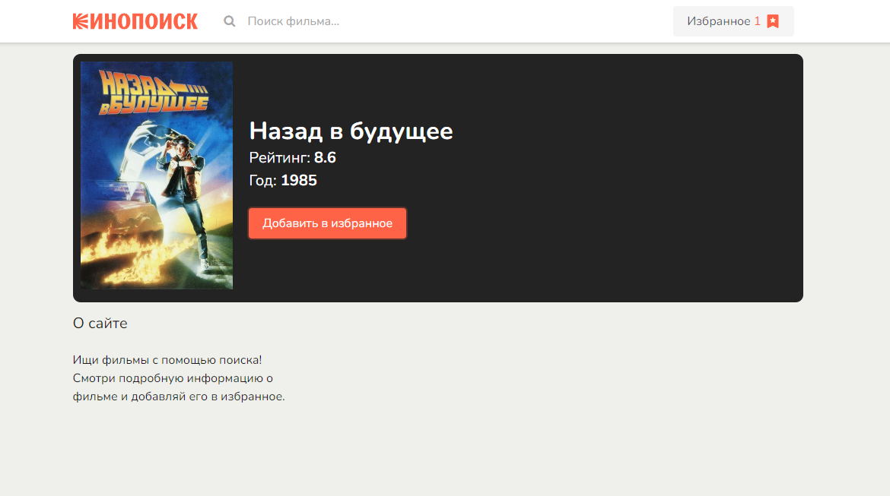
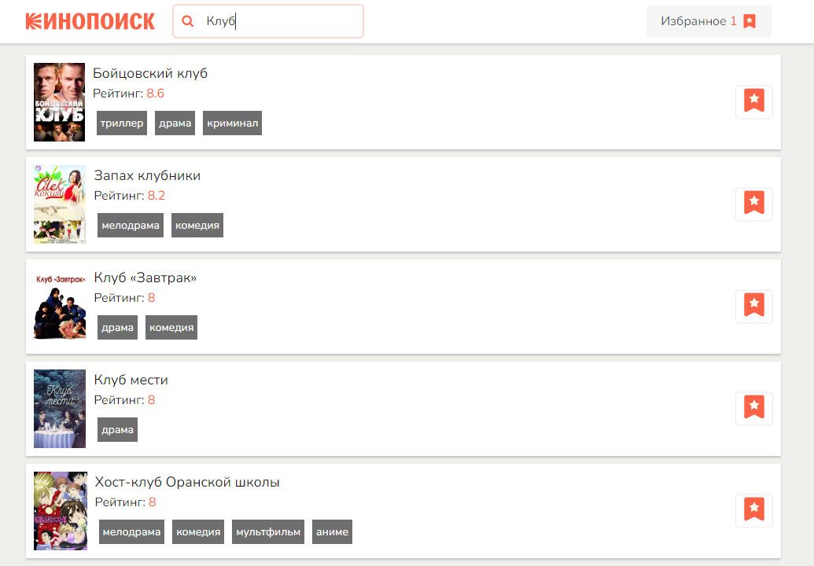
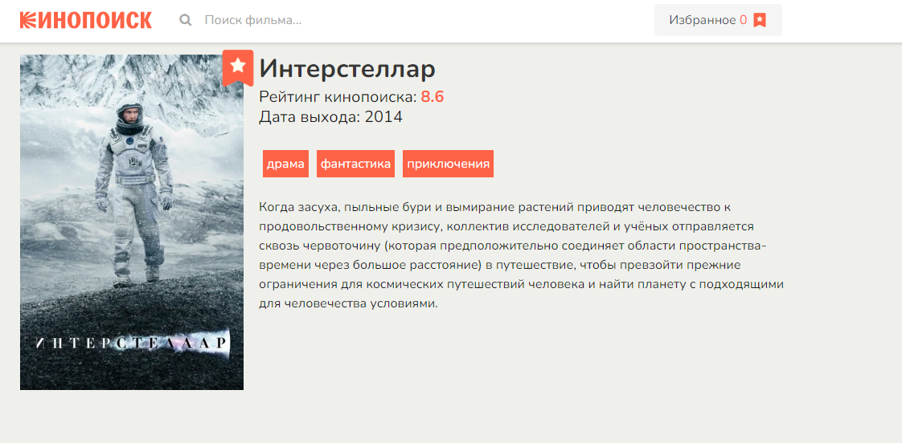

<h2>vue3 kinopoisk</h2>
<h3>Тестовое задание</h3>

    Для запуска приложения:  
    - Создайте файл .env и поместите туда: API_KEY={ВАШ_КЛЮЧ}  
    (ключ можно получить здесь <a href="https://kinopoiskapiunofficial.tech/" target="_blank">kinopoiskapiunofficial.tech</a>)  
    - npm start

